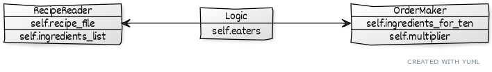

# Architecture

## Structure of the program
todo

## User interface
At the moment there is a temporary text user interface. There will be a graphical user interface with views for user to
- input amount of eaters
- input which recipe files to user
- generate order

## Application logic
Application logic consists of classes [RecipeReader](https://github.com/anuvirtane/ot-harjoitustyo/blob/main/src/recipereader/recipereader.py) and [OrderMaker](https://github.com/anuvirtane/ot-harjoitustyo/blob/main/src/ordermaker/ordermaker.py)

