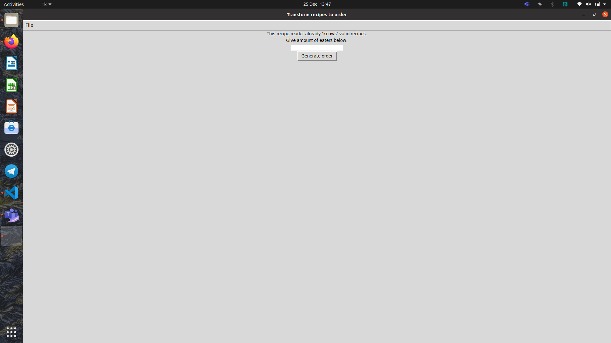
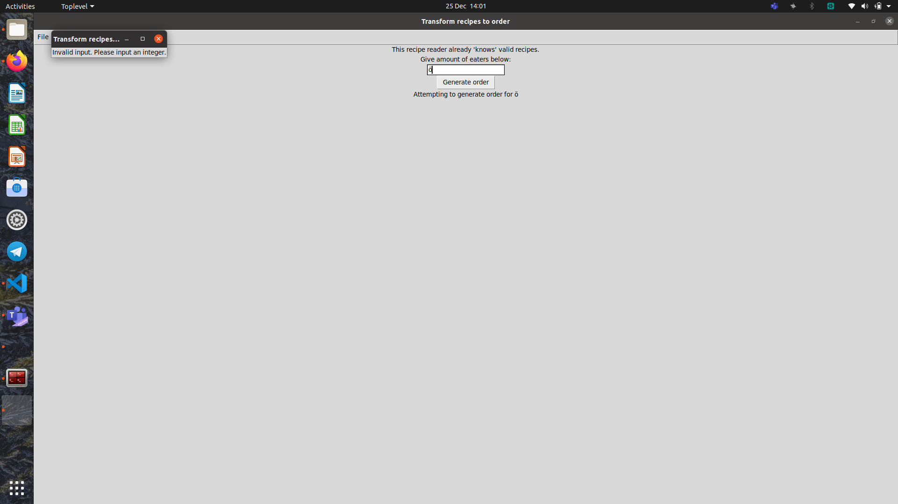
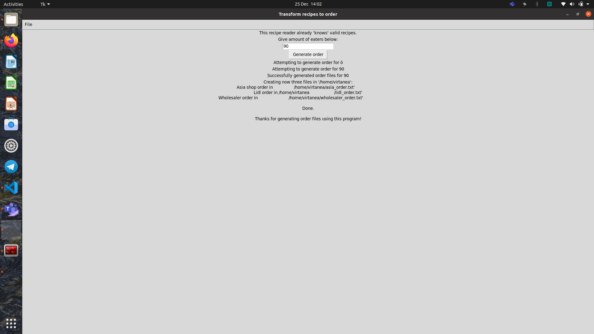

# User guide

At the moment there is only a temporary text based user interface where user can input amount of eaters. Then program prints amounts calculated based on that.

First up, user is prompted to input amount of eaters:

If input is not an integer, an error window comes up:

If input is an integer, order files are generated in user's home folder:

Program can be closed using red X in top right corner, or opening "File" and pressing "Exit" in top left corner.

